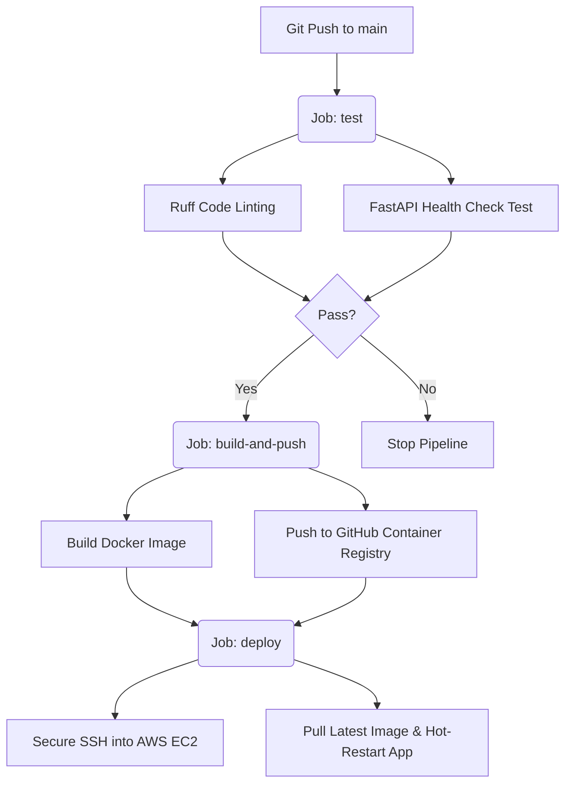

# TradeConnect BD-DE Portal
> **Enterprise Trade Intelligence & Multimodal Logistics Router**

TradeConnect BD-DE is a professional, containerized cloud application designed to optimize and facilitate bilateral commerce between Bangladesh and Germany. Powered by Google's Gemini 2.5 Flash model, the portal features a dual-engine architecture offering highly specialized, structured trade strategy recommendations and multimodal shipping route comparison.

The application is built using a modern cloud-native stack, containerized with Docker, and backed by an automated three-stage CI/CD pipeline that lints, tests, and deploys code directly to an AWS EC2 instance in Stockholm.

---

## 🚀 Key Features

*   **Trade Strategy Advisor (Left Engine):** Analyzes custom trade queries based on real-world $9.81B Bangladesh-Germany bilateral commerce data (such as textile dominances and machinery imports), outputting recommended HS code ranges, compliance notes, and cost-optimization strategies.
*   **Logistics & Route Comparison (Right Engine - depreciated):** Compares Sea, Air, and Multimodal shipping options between specified origin/destination cities, detailing transit times, cost estimates, reliability scores (1-10), key advantages, and risks.
*   **Strict JSON Schema Enforcement:** Integrated with Pydantic schemas to force Gemini to output highly structured, machine-readable JSON data directly at the API layer.
*   **Self-Healing Frontend:** Features a responsive HTML/CSS dashboard with a custom JavaScript parser that strips out markdown wrappers, sanitizes responses, and cleanly renders recommendations into color-coded strategy cards with live error fallback panels.

---

## 🛠️ Tech Stack & DevOps Architecture

*   **Backend:** FastAPI (Python 3.12-slim)
*   **AI Engine:** Google GenAI SDK (Gemini 2.5 Flash API)
*   **Data Validation:** Pydantic v2
*   **Frontend:** HTML5, CSS3 Grid, Vanilla JavaScript (Fetch API)
*   **Containerization:** Docker & Docker Compose
*   **Registry:** GitHub Container Registry (ghcr.io)
*   **CI/CD Engine:** GitHub Actions (Ruff Linter, automated health test checks, and automated building/publishing)
*   **Cloud Hosting:** AWS EC2 (Amazon Linux 2023)
*   **SSL/Security:** Windows Schannel Integration & Git Push Protection

---

## 📦 Project Structure

```directory
tradeconnect-bd-de/
├── .github/
│   └── workflows/
│       └── ci-cd.yml         # 3-Stage CI/CD Pipeline Configuration
├── static/
│   └── index.html            # Color-coded Dual-Engine Dashboard
├── .dockerignore             # Excludes cache, git, and local secrets
├── .gitignore                # Restricts .env files from Git history
├── docker-compose.yml        # Local multi-container orchestration
├── Dockerfile                # Multi-stage optimized Python build image
├── main.py                   # FastAPI application & Gemini integration
├── requirements.txt          # Pinned project dependencies
└── README.md                 # Project documentation
```

---

## ⚙️ Local Development Setup

### Prerequisites
*   Python 3.11 or 3.12
*   Google Gemini API Key (from Google AI Studio)

### Installation
1.  **Clone the repository:**
    ```bash
    git clone https://github.com/your-username/tradeconnect-bd-de.git
    cd tradeconnect-bd-de
    ```

2.  **Create and activate a virtual environment:**
    *   **Windows:**
        ```powershell
        python -m venv venv
        .\venv\Scripts\activate
        ```
    *   **macOS/Linux:**
        ```bash
        python3 -m venv venv
        source venv/bin/activate
        ```

3.  **Install dependencies:**
    ```bash
    python -m pip install -r requirements.txt
    ```

4.  **Configure environment variables:**
    Create a `.env` file in the root directory:
    ```text
    GEMINI_API_KEY=AIzaSyYourActualKeyHere
    ```

5.  **Run the local development server:**
    ```bash
    # Windows
    .\venv\Scripts\fastapi dev main.py
    # macOS/Linux
    fastapi dev main.py
    ```
    Open your browser and navigate to `http://127.0.0.1:8000`.

---

## 🐳 Running with Docker Locally

To run the application inside a fully isolated, production-like environment on your local machine:

1.  **Launch Docker Desktop.**
2.  **Run the Docker Compose suite:**
    ```powershell
    $env:GEMINI_API_KEY="your-api-key"
    docker compose up --build
    ```
3.  Navigate to `http://localhost:8000` in your browser.

---

## 🏁 CI/CD Pipeline (GitHub Actions)

This project features a fully automated, state-of-the-art **Continuous Integration & Continuous Deployment (CD)** pipeline.



### Pipeline Details
1.  **Stage 1: Test**
    *   Clones code, configures Python 3.12, and installs libraries.
    *   Runs the `ruff` linter to enforce PEP 8 styles.
    *   Runs an automated Integration Test that spins up a mock FastAPI client, triggers a `/health` GET request, and asserts a `200 OK` status.
2.  **Stage 2: Build & Push**
    *   Converts repository paths to lowercase dynamically to satisfy Docker tag constraints.
    *   Builds the image and pushes it to `ghcr.io/your-username/tradeconnect:latest`.
3.  **Stage 3: Deploy (Continuous Deployment)**
    *   Connects securely to AWS EC2 using encrypted SSH keys stored in GitHub Secrets.
    *   Remotely stops the active container, pulls the fresh image, and boots the new container with your production API key securely injected.

---

## ☁️ Cloud Deployment (AWS EC2)

The platform is deployed live on a public-facing **AWS t3.micro EC2 Instance** in Stockholm.

*   **Inbound Security Rules:**
    *   Port 22 (SSH) - Restriced to administrative IPs.
    *   Port 8000 (HTTP) - Open to Anywhere (`0.0.0.0/0`) to allow global browser access.
*   **Runtime Hosting:** Managed inside a detached Docker container running on the Linux server.

---

## 🔒 Security Best Practices Implemented

*   **Zero Hardcoded Secrets:** No API keys or SSH credentials are saved in source files. Everything is read at runtime via environment variables or loaded using secure GitHub Repository Secrets.
*   **Robust Ignore Files:** Extensive `.gitignore` and `.dockerignore` filters completely block local `.env` variables and temporary compiled python cache files (`__pycache__`) from entering repository history or container layers.
*   **Git Push Protection Enabled:** Pre-validated commits prevent accidental uploads of secrets before pushes land on GitHub.
